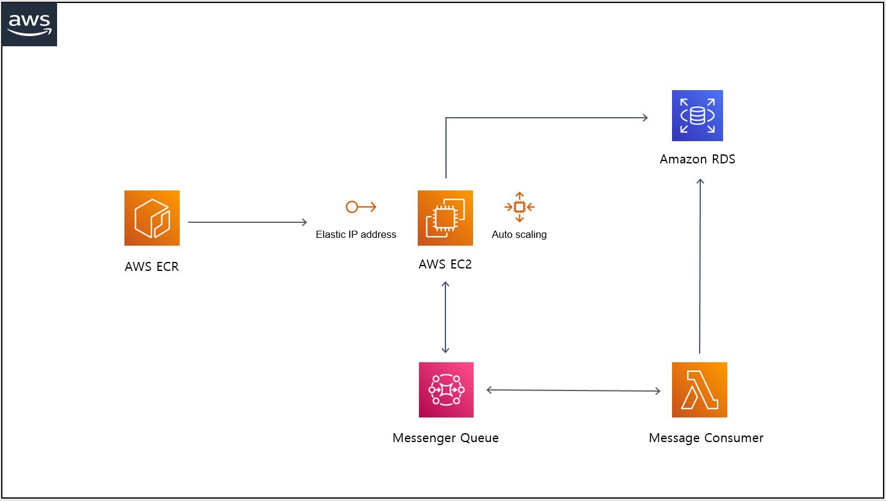

# pacemaker-backend
GPS-based Real-time Running match matching service (Mobile Computing, 2021 Fall)

## Subject
GPS-based Real-time Running mate matching application

## Function
- User management (sign in, sign up, update info)
- Running mate matching (desired options)
- Real-time running tracking (using GPS, Accelerometer)
- Real-time running pattern feedback (using Vibrate, Sound push alarms)
- Intuitive history result

## Architecture



## API Spec
- Issue 참조

## Deployment

### Application build (on Local)
```
// Requires java version 11 or higher
./gradlew bootJar
```

---

### Docker image build and push (on Local)
```
// Requires aws cli and docker
aws ecr get-login-password --region ap-northeast-2 | docker login --username AWS --password-stdin {AWS ECR Endpoint}
docker buildx build -t pacemaker-backend . --linux/amd64
docker tag pacemaker-backend:latest {AWS ECR Endpoint}pacemaker-backend:latest
docker push {AWS ECR Endpoint}/pacemaker-backend:{tag}
```

---

### Docker image pull (on EC2)
```
// Requires java version 11 or higher
// Requires aws cli and docker
aws ecr get-login-password --region ap-northeast-2 | docker login --username AWS --password-stdin {AWS ECR Endpoint}
docker pull {AWS ECR Endpoint}/pacemaker-backend:{tag}
```

---

### Docker container run (on EC2)
```
// Requires that port of inbound, outbound of EC2 security group must be open.
docker images
docker run -d -p 80:8080 {docker image id}
// If you want to check the log
docker ps
docker log -t -f {docker container id}
```

---

- [proposal.pdf](https://github.com/SeoSeongHo/pacemaker-backend/blob/master/proposal.pdf)
